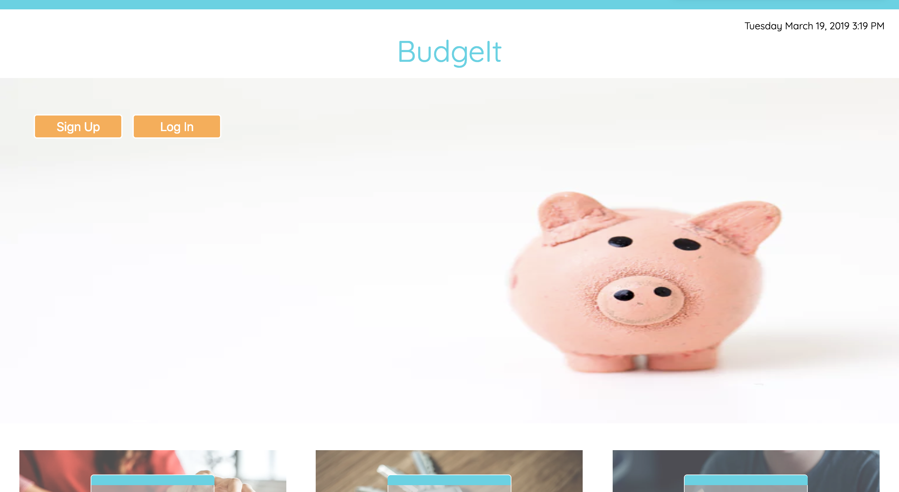

# BudgeIt Frontend

This application allow users to track their expenses with customized budgets and categories. User is able to set a budget with a date range and an amount, create a category, and keep track of expenses.

## Contents

- [Getting Started](#getting_started)
- [Built With](#built_with)
- [Versioning](#versioning)
- [Development](#development)
- [Demo](#demo)

## Getting Started

Fork and clone this repository. `cd` into directory. Run `npm install` to install dependencies. Run `npm start` for development server will be launched.

Ensure to run installation for backend for full application: [Back-End](https://github.com/sinyoungnam/budgeit_backend)

## Built With

Visual display of a user's expenses and budgets with Chart.js. Worked with React for frontend development. Used Redux for state management, created reducers with pure functions and actions to dispatch events and store to maintain the state. Worked with React-Router for routing. Used JSX, HTML, and custom CSS to create responsive layouts, navigation and tables. Implemented JWT token based authentication for the REST API to authorize and authenticate a user.

## Versioning

* react version ^16.6.3
* npm version 6.5.0

## Development

Ideas for future features:

### Link to bank account

Allowing a user to have an option to link to their bank account to keep track of their budget, payments, and bills.

### Calendar

Incorporating a calendar for simple visual and easy navigation. Keep track throughout the week/month/year.

## Demo

[Demo](https://www.youtube.com/watch?v=eERwXQJMPkQ)
